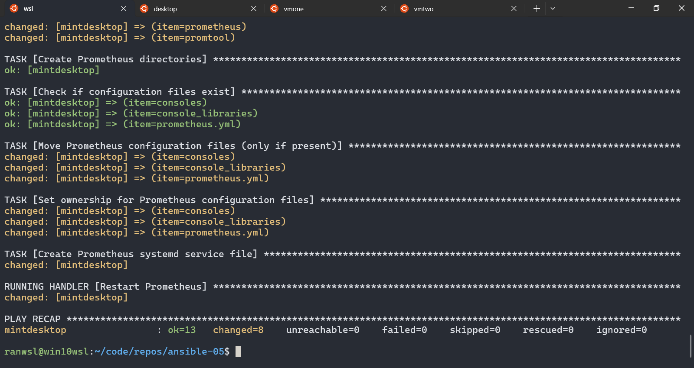
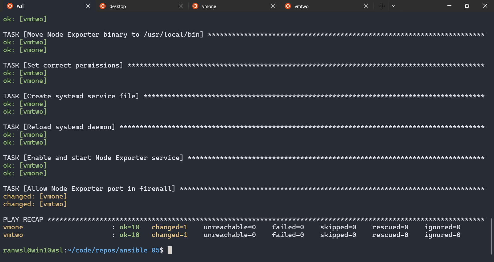
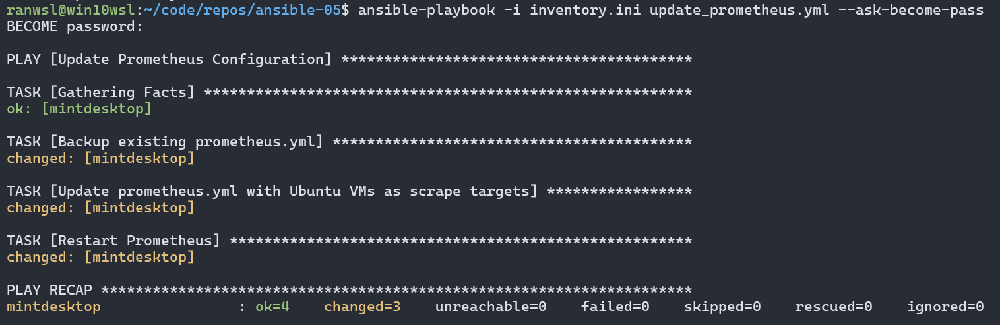
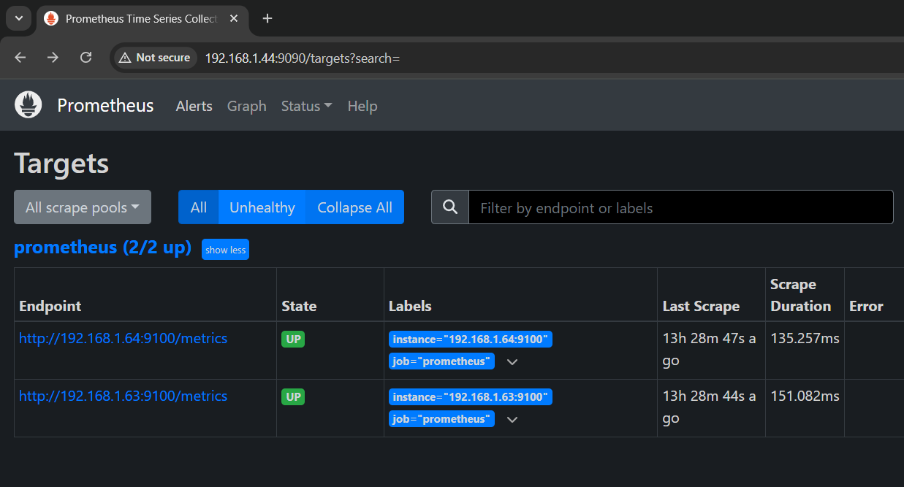
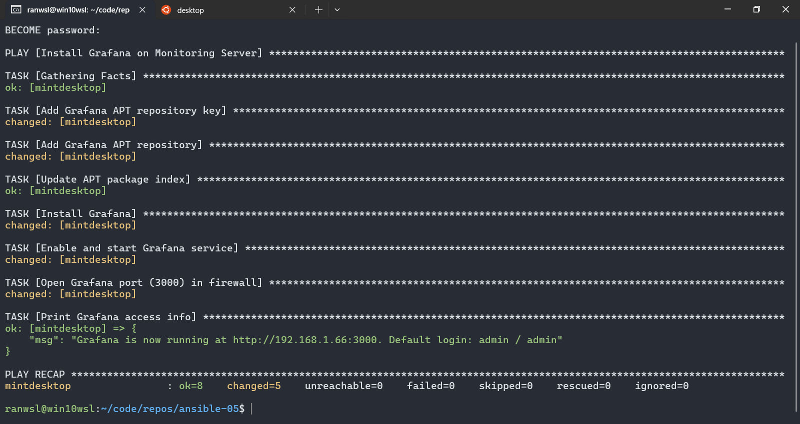

# ansible-05

## Infrastructure Monitoring with Prometheus & Grafana

## Overview

This project sets up infrastructure monitoring using Prometheus and Grafana on a Linux Mint desktop acting as the monitoring server. It also includes Node Exporter to collect system metrics from Ubuntu VMs.

## Components

- **Prometheus**: Collects and stores metrics.
- **Node Exporter**: Gathers system metrics from Ubuntu VMs.
- **Grafana**: Provides a web-based interface for visualizing metrics.

## Prerequisites

- A Linux Mint desktop as the monitoring server.
- Two Ubuntu 24.04 VMs as monitored nodes.
- Ansible installed on the control node (WSL Ubuntu).
- SSH key-based authentication configured between Ansible control node and managed nodes.

## Installation Steps

### 1️⃣ Install Prometheus

Run the Ansible playbook to install Prometheus on the monitoring server:

```bash
ansible-playbook -i inventory.ini install_prometheus.yml --ask-become-pass
```



Access Prometheus web UI:

```text
http://<mintdesktop-IP>:9090
```

### 2️⃣ Install and Configure Node Exporter on Ubuntu VMs

Run the Ansible playbook to install and configure Node Exporter:

```bash
ansible-playbook -i inventory.ini install_node_exporter.yml --ask-become-pass
```



### 3️⃣ Configure Prometheus to Scrape Node Exporter Metrics Using Ansible

Run the Ansible playbook to update Prometheus configuration:

```bash
ansible-playbook -i inventory.ini update_prometheus.yml --ask-become-pass
```



This will modify `prometheus.yml` to include Ubuntu VMs:

```yaml
global:
  scrape_interval: 15s

scrape_configs:
  - job_name: 'prometheus'
    static_configs:
      - targets: ['localhost:9090']

  - job_name: 'node_exporter'
    static_configs:
      - targets:
          - "192.168.1.63:9100"
          - "192.168.1.64:9100"
```



### 4️⃣ Install Grafana

Run the Ansible playbook to install Grafana:

```bash
ansible-playbook -i inventory.ini install_grafana.yml --ask-become-pass
```



Access Grafana web UI:

```text
http://<mintdesktop-IP>:3000
```

(Default login: `admin/admin`)

### 5️⃣ Add Prometheus as a Data Source in Grafana

1. Go to **Settings** → **Data Sources** → **Add Data Source**.
2. Select **Prometheus**.
3. Set URL to:

   ```text
   http://<mintdesktop-IP>:9090
   ```

4. Click **Save & Test**.

### 6️⃣ Import a Prebuilt Node Exporter Dashboard

1. Go to **Dashboards** → **Import**.
2. Enter Dashboard ID: **1860**.
3. Select **Prometheus** as the data source.
4. Click **Import**.

## Verification

- Check Prometheus UI to confirm targets are being scraped.
- View system metrics in Grafana under the imported dashboard.
